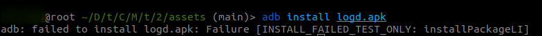
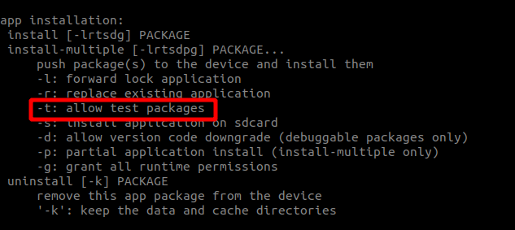
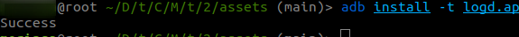
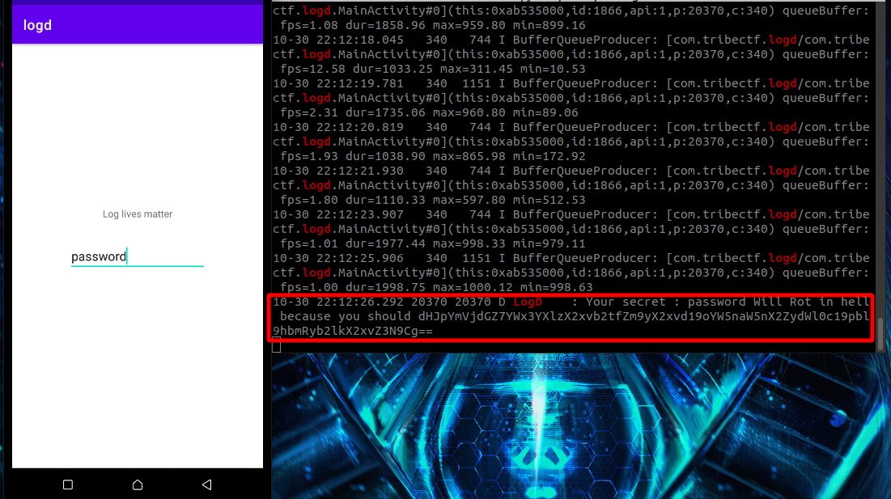
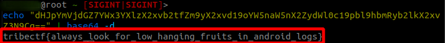
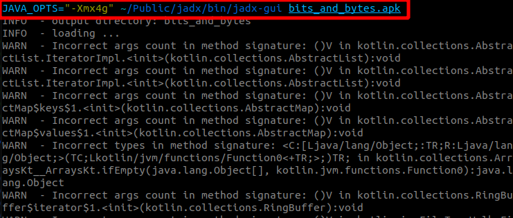
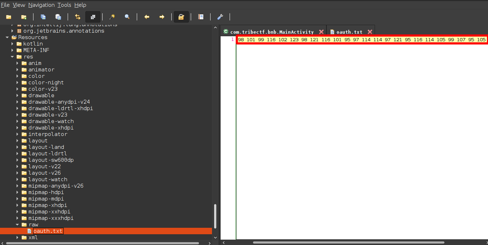
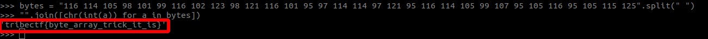

# Logd Mobile Challenge Writeup

- Challenge Description
  - most developers forget to turn off logging in production build and sensitive information such as oauth tokens, passwords and such can be simply found by looking at the application logs.


- Challenge Artifact
[logd.apk](assets/logd.apk)

## Flag Hunt
Following the challenge description, the first instinct was to install the application and monitor the logs.



but oops! , not possible.

on looking up adb app installation documentation, we can install the app by simply adding a ```-t``` argument


we fire up the terminal again and yaaay!!



installation successful!!

Next, we launch the application and fire up adb logcat to monitor the logs
```adb logcat | grep -i logd```

we use grep here to get logs from the logd application instead of the whole system logs, an altenative would be to use the app's pid.

it appears the input from the app gets logged with an interesting encrypted string appended.
The string ends with "==" , pretty common in base64 encryption.



we pipe the string to base64 with a ```-d``` argument meaning decrypt and boom!! we got our flag :)



# Bits and Bytes Mobile Challenge Writeup

- Challenge Description
  - Most security aware developers use a byte array trick to hide api keys and other sensitive info in the application.
I challenge you to get thet flag :)

- Challenge Artifact
[bits_and_bytes.apk](assets/bits_and_bytes.apk)


## Flag Hunt
Hmmmmm, quite an interesting challenge.
From the description hint, "byte array" means the flag won't be in basic Ascii, 
running strings on the package bores no results as expected ```strings bits_and_bytes```
that calls for manual code review.
so we use jadx to decompile the package to java and pass some flags to increase the heap and optimize decompilation.

 

going through the app, there's nothing interesting in the ```AndroidManifest.xml``` or the```MainActivity``` , so we go ahead and look for anything interesting in the resources folder.



and ye!, we find some perculiar oauth.txt file with odd looking numbers, hmmm.
It looks like more of ascii values, so a simple python script did the tick



